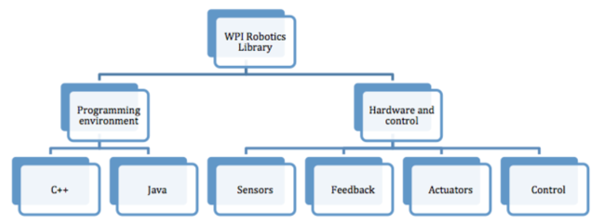
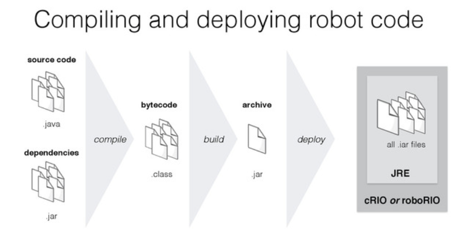
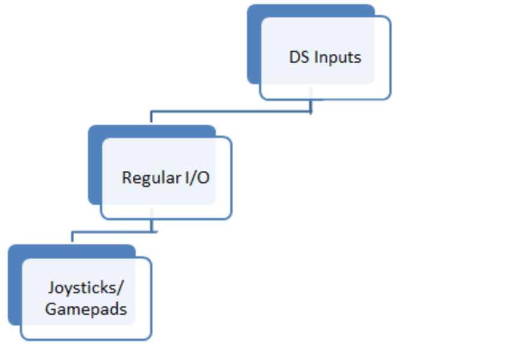
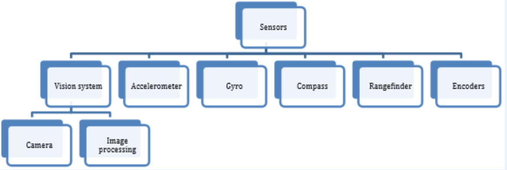

# WPILibrary Overview
WPILib simplifies the effort of controlling robot functions. WPILib was
developed at Worcester Polytechnic Institute. The WPI Robotics library
(WPILib) is a set of software classes that interfaces with the hardware
and software in common FRC robots' control systems. There are classes to
handle sensors, motors, the driver station, and a number of other
utility functions such as timing and field management.



**Note: [The Python library RobotPy is also available via FRC Team
294](https://robotpy.github.io/faq/).**

WPILib provides base classes such as Iterative Robot for robot programming.
For Spartronics, we use Command-base robot model that WPILib offers for
creating our robot. It provides built in support for making it easy to design
our robot, its subsystems, and control interactions between the robot and the
operator interface. See more in [Command Based
Programming](commands_subsystems/README.md).

## roboRIO
Introduced in 2015 competition season, [NI
roboRIO](https://decibel.ni.com/content/docs/DOC-30419) is National
Instrument's reconfigurable I/O controller built for student robotics teams,
and is included in rookie team's kit of parts.
The roboRIO adds robot-oriented I/O such as CAN and PWM. The roboRIO runs [NI
Linux Real-Time OS](http://www.ni.com/white-paper/14626/en/).

## roboRIO and Java Development Toolkit
Running robot Java programs requires the Java runtime to be installed on the
roboRIO. This can be done using the FRC Java Installer application. The
application itself uses java, so Java 8 must be installed on the development
system to use the installer. See [installation
instructions](http://wpilib.screenstepslive.com/s/4485/m/13809).

**Note: Whenever a new image is installed on the roboRIO (either when initially
setting it up or later if the image is updated or reinstalled) the Java
runtime must be replaced.**

Java and C++ programming utilize Eclipse as a development environment. The FRC
specific tools for the chosen language are installed as Eclipse plugins. See
[installation instructions for setting up Eclipse development
environment](http://wpilib.screenstepslive.com/s/4485/m/13809).

Note: to deploy the compiled java code, your computer must be connected to the
robot's network.



## WPILibJ
The WPI Robotics library (WPILibJ) is a set of Java classes that interfaces to
the hardware in the FRC control system and your robot. See [online
documentation](http://first.wpi.edu/FRC/roborio/release/docs/java/).

### Autonomous vs. TeleOp
Robot.java class and methods control robot's autonomous and teleop operations.

```java
import edu.wpi.first.wpilibj.IterativeRobot;

/*
 * The JVM is configured to automatically run this class, and to call the
 * functions corresponding to each mode, as described in the IterativeRobot
 * documentation. If you change the name of this class or the package after
 * creating this project, you must also update the manifest file in the
 * resource directory.
 */
public class Robot extends IterativeRobot {

	public static final ExampleSubsystem exampleSubsystem = new ExampleSubsystem();
	public static OI oi;

    Command autonomousCommand;
    SendableChooser chooser;

    /*
     * This function is run when the robot is first powered on and should be
     * used for any initialization code.
     */
    public void robotInit() {
		oi = new OI();
        chooser = new SendableChooser();
        chooser.addDefault("Default Auto", new ExampleCommand());
        SmartDashboard.putData("Auto mode", chooser);
    }

	/*
     * This function is called once each time the robot enters disabled mode.
     * You can use it to reset any subsystem information you want to clear when
	 * the robot is disabled.
     */
    public void disabledInit(){

    }

    /*
     * Periodic code for disabled mode goes here. You can use it to update
     * internal values while the robot is not enabled.
     */
	public void disabledPeriodic() {
		Scheduler.getInstance().run();
	}

	/*
	 * This autonomous (along with the chooser code above) shows how to select
	 * between different autonomous modes using the dashboard. The
	 * sendable chooser code works with the Java SmartDashboard.
	 */
    public void autonomousInit() {
        autonomousCommand = (Command) chooser.getSelected();

    	// schedule the autonomous command (example)
        if (autonomousCommand != null) autonomousCommand.start();
    }

    /*
     * This function is called periodically during autonomous
     */
    public void autonomousPeriodic() {
        Scheduler.getInstance().run();
    }

    /*
     * This code is called once each time the robot begins teleoperated mode
     */
    public void teleopInit() {
		// This makes sure that the autonomous stops running when
        // teleop starts running.
        if (autonomousCommand != null) autonomousCommand.cancel();
    }

    /*
     * This function is called periodically during operator control
     */
    public void teleopPeriodic() {
        Scheduler.getInstance().run();
    }

    /*
     * This function is called periodically during test mode
     */
    public void testPeriodic() {
        LiveWindow.run();
    }
}
```

### RobotDrive
WPILib provides a RobotDrive object that handles most cases of driving the
robot either in autonomous or teleop modes. It is created with either two or
four speed controller objects. There are methods to drive with either Tank,
Arcade, or Mecanum modes with variable inputs or with Joystick objects as
parameters.

  - Arcade Drive: single joystick is used for driving. The X-axis is selected
  by default for the turn axis and the Y-axis is selected for the speed axis.
  - Tank Drive:  tank steering using two joysticks for driving.
  - Mecanum Drive: drive method for Mecanum wheeled robots. Mecanum wheels on
  the chassis to enable the robot to drive in any direction without first
  turning.

Also refer to [Talon SRX](actuators/talon/README.md) for creating a RobotDrive
object with Talon speed controllers.

```java
// RobotDrive constructors
// Constructor for RobotDrive with 2 motors specified with channel numbers.
RobotDrive(int leftMotorChannel, int rightMotorChannel);

// Constructor for RobotDrive with 4 motors specified with channel numbers.
RobotDrive(int frontLeftMotor, int rearLeftMotor, int frontRightMotor, int rearRightMotor);

// Constructor for RobotDrive with 2 motors specified as SpeedController
// objects.
RobotDrive(SpeedController leftMotor, SpeedController rightMotor);

// Constructor for RobotDrive with 4 motors specified as SpeedController
// objects.
RobotDrive(SpeedController frontLeftMotor, SpeedController rearLeftMotor, SpeedController frontRightMotor, SpeedController rearRightMotor);
```

### Driver Station
The FRC Driver Station software serves as the interface between the human
operators and the robot. The software takes input from a number of sources and
forwards it to the robot where the robot code can act on it to control
mechanisms.

#### Driver Station Class
The Driver Station class has methods to access information such as the robot
mode, battery voltage, alliance color and team number. The DriverStation class
is constructed as a singleton by the base class.

``` java
// Get access to the methods of the DriverStation object constructed by the
// base class and store the object
DriverStation ds = DriverStation.getInstance();
ds.someMethod();

// Or call DriverStation directly when needed
DriverStation.getInstance().someMethod();
```

The DriverStation class also has methods for determining if the DS is connected
to the robot, if the DS is connected to FMS, querying if the FPGA outputs are
enabled (IsSysActive), and querying if the roboRIO is in brownout protection.

```java
// Testing for DS Attached, FMS Attached and System status
boolean exampleBool;
exampleBool = DriverStation.getInstance().isDSAttached();
exampleBool = DriverStation.getInstance().isFMSAttached();
exampleBool = DriverStation.getInstance().isSysActive();
exampleBool = DriverStation.getInstance().isSysBrownedOut();
```

For compatibility purposes the robot's battery voltage can be retrieved using
the DriverStation class (it is now also available from the ControllerPower
class as the roboRIO input voltage). This information can be queried from the
DriverStation class in order to perform voltage compensation or actively manage
robot power draw by detecting battery voltage dips and shutting off or limiting
non-critical mechanisms,

```java
// Get Battery Voltage
double voltage = DriverStation.getInstance().getBatteryVoltage();
```

The getLocation() method of the Driver Station returns an integer indicating
which station number the Driver Station is in (1-3). Note that the station that
the DS and controls are located in is not typically related to the starting
position of the robot so this information may be of limited use. When not
connected to the FMS software this state is determined by the Team Station
dropdown on the DS Operation tab.

```java
// Get physical location of the Driver Station
int station;
station = DriverStation.getInstance().getLocation();
```

### Operator interfaces (OI)
Different types of inputs that may be transmitted by the DS software. The most
common input to is an HID compliant joystick or gamepad such as the Logitech
Attack 3 or Logitech Extreme 3D Pro joysticks which have been provided in the
Kit of Parts since 2009. Note that a number of devices are now available which
allow custom IO to be exposed as a standard USB HID device such as the The TI
Launchpad and 16 Hertz Leonardo++ included in your Kit of Parts.



#### Joystick Mapping
FRC Driver Station contains indicators of the values of axes buttons and the
POV that can be used to determine the mapping between physical joystick
features and axis or button numbers. Simply click the joystick in the list to
select it and the indicators will begin responding to the joystick input.

### Sensors
The WPI Robotics Library supports the sensors that are supplied in the FRC kit
of parts, as well as many commonly used sensors available to FIRST teams
through industrial and hobby robotics suppliers.



On the roboRIO, the FPGA implements all the high speed measurements through
dedicated hardware. The library natively supports sensors in the categories
shown below:

  - Wheel/motor position measurement - Gear-tooth sensors, encoders, analog
  encoders, and potentiometers
  - Robot orientation - Compass, gyro, accelerometer, ultrasonic rangefinder
  - Generic - Pulse output counters, analog, I2C, SPI, Serial, digital input

### Actuators
WPILib provides support for various actuators. Also refer to [Talon
SRX](actuators/talon/README.md) for details on programming with Talon SRX.


#### Motor Safety
The purpose of the Motor Safety mechanism is the same as the purpose of a
watchdog timer, to disable mechanisms which may cause harm to themselves,
people or property if the code locks up and does not properly update the
actuator output. Motor Safety breaks this concept out on a per actuator basis
so that you can appropriately determine where it is necessary and where it is
not. Examples of mechanisms that should have motor safety enabled are systems
like drive trains and arms. If these systems get latched on a particular value
they could cause damage to their environment or themselves. An example of a
mechanism that may not need motor safety is a spinning flywheel for a shooter.
If this mechanism gets latched on a particular value it will simply continue
spinning until the robot is disabled. By default Motor Safety is enabled for
RobotDrive objects and disabled for all other speed controllers and servos.

The Motor Safety feature operates by maintaining a timer that tracks how long
it has been since the feed() method has been called for that actuator. Code in
the Driver Station class initiates a comparison of these timers to the timeout
values for any actuator with safety enabled every 5 received packets (100ms
nominal). The set() methods of each speed controller class and the set()
and setAngle() methods of the servo class call feed() to indicate that the
output of the actuator has been updated.

Note that this protection mechanism is in addition to the System Watchdog which
is controlled by the Network Communications code and the FPGA and will disable
all actuator outputs if it does not receive a valid data packet for 125ms.

```java
// Enabling/disabling motor safety
exampleJaguar.setSafetyEnabled(true);
exampleJaguar.setSafetyEnabled(false);
```

Depending on the mechanism and the structure of your program, you may wish to
configure the timeout length of the motor safety (in seconds). The timeout
length is configured on a per actuator basis and is not a global setting. The
default (and minimum useful) value is 100ms.

```java
// Configuring the Safety timeout (in seconds)
exampleJaguar.setExpiration(0.1);
```

### SmartDashboard
The SmartDashboard is a Java program that will display robot data in real time.
It is a useful utility to monitor robot code. See [SmartDashboard
documentation](http://wpilib.screenstepslive.com/s).

  - Displays robot data and debugging information from robot code
  - Displays the state of the robot program such as the currently executing
  commands and the status of any subsystems
  - Displays buttons that you can press to activate robot commands and set
  system variables
  - Allows you to choose startup options on the dashboard that can be read by
  the robot program

#### Test Mode and Live Mode
You may add code to your program to display values for your sensors and
actuators while the robot is in Test mode. This can be selected from the Driver
Station whenever the robot is not on the field. Test mode is designed to verify
the correct operation of the sensors and actuators on a robot. In addition it
can be used for obtaining setpoints from sensors such as potentiometers and for
tuning PID loops in your code.

### Network Tables
SmartDashboard uses NetworkTables for communicating values between the robot
and the driver station laptop. Network Tables acts as a distributed table of
name and value pairs. If a name/value pair is added to either the client
(laptop) or server (robot) it is replicated to the other. If a name/value pair
is deleted from, say, the robot but the SmartDashboard or OutlineViewer are
still running, then when the robot is restarted, the old values will still
appear in the SmartDashboard and OutlineViewer because they never stopped
running and continue to have those values in their tables. When the robot
restarts, those old values will be replicated to the robot.

To ensure that the SmartDashboard and OutlineViewer are showing exactly the
same values, it is necessary to restart them on every single computer. That way,
old values that one is holding won't get replicated to the others.

This usually isn't a problem if the program isn't constantly changing, but if
the program is in development and the set of keys being added to NetworkTables
is constantly changing, then it might be necessary to do the restart of
everything to accurately see what is current.
